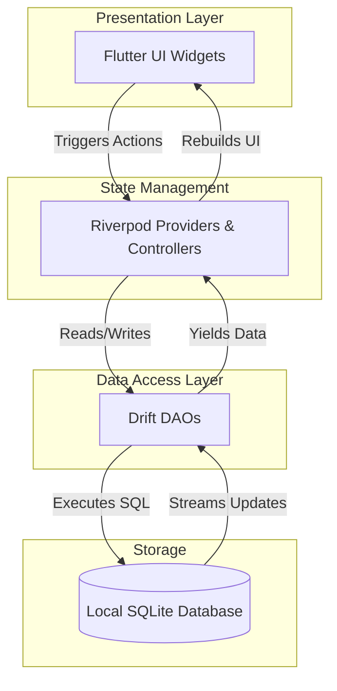
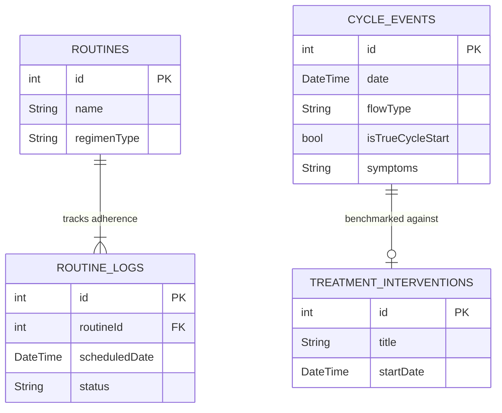

# Ila Architecture

Ila is built on a 100% local-first, offline architecture designed to maximize user privacy and clinical utility.

## 1. System Architecture Flow

## 2. Database Schema (Drift / SQLite)
Ila relies on a relational, type-safe SQLite database powered by `drift`.

### Core Tables & Relationships:
- **`CycleEvents`**: The central table for logging flows, symptoms, and pain. The `isTrueCycleStart` flag differentiates between actual menstrual phase starts (Day 1) and mid-cycle spotting, ensuring median cycle lengths and PMDD predictions are mathematically sound.
- **`TreatmentInterventions`**: Logs medical interventions (e.g., "Started Metformin"). This table is cross-referenced against `CycleEvents` to calculate "Pre-Treatment" vs "Post-Treatment" benchmarks (median cycle length, heavy bleeding days).
- **`Routines` & `RoutineLogs`**: `Routines` defines the regimen (e.g., `Cyclic_21_7` or `Daily`), while `RoutineLogs` tracks the daily adherence (`Taken`, `Missed`). The `ReportDao` aggregates these logs to provide a 6-month Adherence Percentage for the doctor.

## 3. State Management (Riverpod)
- **Dependency Injection**: Riverpod provides global access to the `AppDatabase` and its associated DAOs (`CycleDao`, `RoutineDao`, `ReportDao`).
- **Reactive UI**: The UI listens to database changes via StreamProviders (e.g., watching all logs for today). When the user taps "Mark as Taken", the Controller modifies the database, and the StreamProvider automatically pushes the new state to the UI without manual `setState` calls.
- **Business Logic Separation**: Controllers (like `TodayController` and `ReportController`) handle the heavy lifting (date math, PDF generation) and sit completely separate from the Widget tree.
