# Clinical Math & Diagnostic Algorithms

Imyra distinguishes itself from standard period trackers by employing clinical phase clustering based on established diagnostic criteria. This document outlines the logic used by the `ReportDao` to categorize symptoms.

## Phase Visualization Flow

```mermaid
gantt
    title Clinical Cycle Phase Algorithm
    dateFormat  X
    axisFormat %s
    
    section Current Cycle
    Menstrual Phase (Days 0-4)      :active, a1, 0, 4d
    Mid-Cycle Phase (Days 5+)       :a2, 4, 17d
    
    section Next Cycle
    Luteal Phase (Days -7 to -1)    :crit, a3, 21, 7d
    Next Menstrual Phase            :a4, 28, 4d
```

## Premenstrual Dysphoric Disorder (PMDD) Clustering
According to the DSM-5 criteria for PMDD, symptoms must occur in the final week before the onset of menses and begin to improve within a few days after the onset of menses.

To detect this, Imyra's algorithm works backwards from confirmed cycle start dates (`isTrueCycleStart = true`):
1. **Luteal Phase (PMDD Indicator):** Any symptom logged between **Days -7 and -1** relative to the *next* cycle start date is clustered into the Luteal Phase.
2. If a specific symptom (e.g., "Severe Anxiety") occurs in this -7 to -1 window across more than 70% of logged cycles, the algorithm flags it in the PDF Report as `⚠️ Luteal Clustering (PMDD)`.

## Dysmenorrhea & Menstrual Phase Clustering
Symptoms associated with menstruation itself (e.g., severe pelvic pain, heavy bleeding) must be clustered at the beginning of the cycle.
1. **Menstrual (Dysmenorrhea) Phase:** Any symptom logged between **Days 0 and 4** relative to the *current* cycle start date is clustered here.
2. If a symptom falls into this window with >70% frequency, it is flagged as `🩸 Menstrual Clustering`.

## Mid-Cycle / Follicular Phase
Any symptom that falls outside of the Luteal and Menstrual windows is categorized as `Mid-Cycle / Ovulatory`. If a symptom is evenly distributed across all three phases, the report flags it as `Scattered / No Pattern`, which clinically implies the symptom is chronic or unrelated to hormonal fluctuations.

## The Importance of `isTrueCycleStart`
A common failure in standard tracking apps is treating pre-menstrual spotting as Day 1 of a cycle, which ruins average cycle length math. Imyra allows users to log spotting without triggering a new cycle (via the `isTrueCycleStart` boolean), ensuring the Luteal math is anchored to the true physiological start of menstruation.
