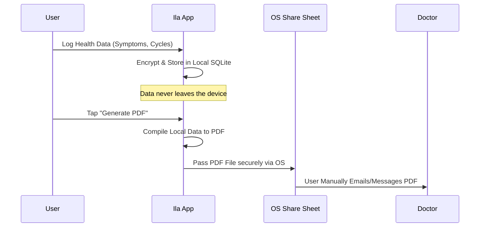

# Store Submission & Privacy Guide

Because Ila is a strict local-first application designed for clinical compliance and absolute privacy, answering App Store and Google Play privacy questionnaires is incredibly straightforward.

## Data Flow Diagram

## Apple App Store: Privacy Nutrition Labels

When submitting to App Store Connect, under **App Privacy**:
1. **Data Collection:** Does your app collect data from this app?
   - **Answer:** **No.**
2. **Explanation:** Since Ila uses an encrypted SQLite database stored securely within the app's local sandbox, and does not sync to iCloud, Firebase, or any external servers, you technically do not "collect" data off the device. All data remains with the user.
3. **Resulting Label:** "Data Not Collected". This is a massive selling point for the app.

## Google Play Console: Data Safety Form

When submitting to the Google Play Console, under **App Content > Data Safety**:
1. **Data Collection and Security:** 
   - Does your app collect or share any of the required user data types? 
   - **Answer:** **No.**
2. **Resulting Label:** "No data shared with third parties" and "No data collected".

## Important Submission Notes
- **Analytics:** Do not add Firebase Analytics, Mixpanel, or Meta Pixels in the future without explicitly updating these labels. Adding them breaks the "Local-First" promise.
- **Data Export:** The only time data "leaves" the app is when the user explicitly triggers the PDF Generation and shares it via the native iOS/Android Share Sheet. Because this is user-initiated and handled by the OS, it does not count as developer data collection.
